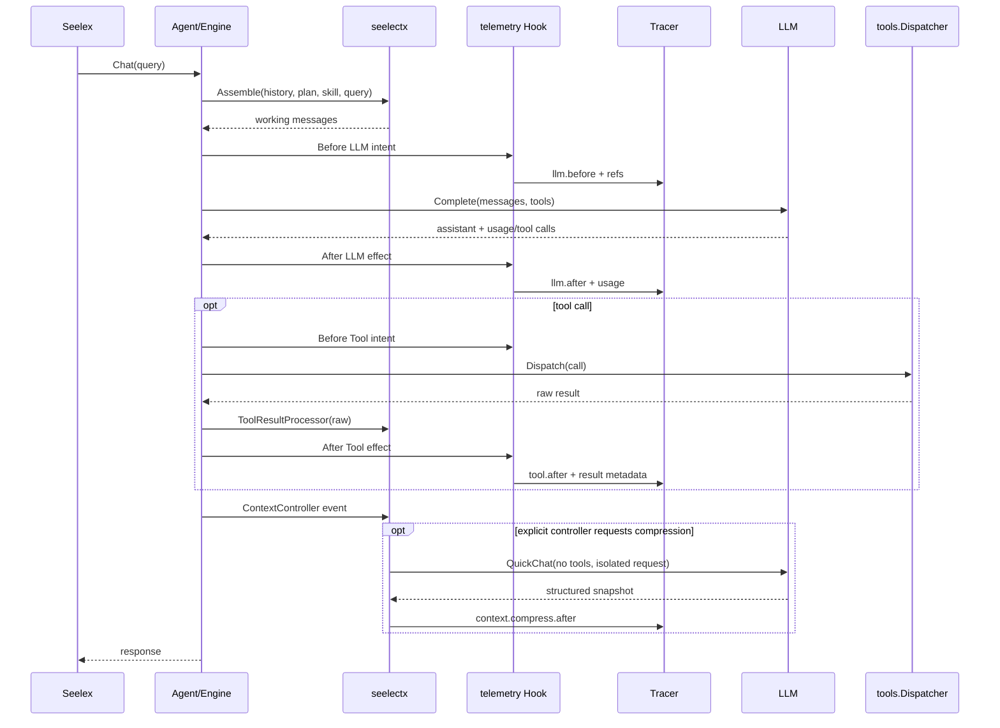

# Seele 扩展契约与详细设计

## Agent 装配

```go
type Components struct {
    Completer       Completer
    StreamCompleter StreamCompleter
    EventCompleter  StreamEventCompleter
    Tools           ToolRuntime
    Logger          Logger
}

func NewWithComponents(components Components) (*Agent, error)
```

`Completer` 是最低必需能力；流式 client、工具 runtime、history owner、ContextController、telemetry hook 均可选。client 的 key、URL、模型和 provider entry 不被 Seele 强制成唯一配置格式，调用方可以硬编码或通过 `accountpool`/自定义 resolver 注入。

Engine 依赖的运行时也只需要：

```go
type Runtime interface {
    VisibleTools(context.Context) []types.Tool
    Dispatch(context.Context, string, string) (string, error)
    LLM() types.ChatCompleter
}
```

## WorkPlan

```go
type Node interface {
    ID() string
    Run(context.Context, *types.WorkflowContext) (string, error)
}

type NodeEncoder interface {
    EncodeNode(Node) (NodeDefinition, error)
}

type NodeDecoder interface {
    DecodeNode(NodeDefinition) (Node, error)
}
```

Plan 经过 `Build`、`Validate` 后由 `Seal` 转为不可变执行定义。Scheduler 只调用 `Node.Run`，不检查 `Kind`，不持有 AgentFactory、TaskExecutor 或 provider。AutoNode/FunctionNode/LLMNode 是可替换的 Seele 实现，不是 Plan 核心协议。

## AccountPool

```go
type Account[T any] struct {
    ID string
    Value T
    MaxConcurrency int
    Metadata map[string]string
}

type Pool[T any] interface {
    Acquire(context.Context, AcquireRequest) (*Lease[T], error)
    Register(Account[T]) error
    Enable(string) error
    Disable(string) error
    Stats() Stats
}
```

实现使用 `sync.Map` 存放账号状态，以每账号有界 channel 作为 semaphore。默认 P2C selector 随机抽取两个候选并按 `Active/MaxConcurrency` 评分；selector 和 LoadMetric 可注入。Lease 的 `Release/Close` 幂等。

## Tools

```go
type ToolHandler interface {
    Execute(context.Context, string) (string, error)
}

type ToolProvider interface {
    ProviderName() string
    Tools() []ToolEntry
}

type Dispatcher interface {
    Dispatch(context.Context, ToolCall) (string, error)
}
```

`tools.Registry` 聚合 provider 并发布不可变 snapshot；MCP、microHub、Skills 使用 `tools/adapter` 的 Catalog/Invoker 适配。Registry 负责 provider 重名、tool 重名、可见定义、超时、重试和 middleware；具体工具 handler 不依赖 Agent。

## Context

```go
type DurableHistory interface {
    Load(context.Context) ([]types.Message, error)
    Save(context.Context, []types.Message) error
    Clear(context.Context) error
}

type RequestAssembler interface {
    Assemble(context.Context, AssemblyRequest) (AssembledRequest, error)
}

type Compressor interface {
    Compress(context.Context, CompressionRequest) (CompressionResult, error)
}

type ContextController interface {
    Handle(context.Context, ContextEvent) (ContextDecision, error)
}
```

可插拔原子策略包括：`StructuralSegmenter`（turn/字符/tool exchange）、`FlattenToolExchanges`、`RelevanceSelector`、`PlaceholderRequestAssembler`、`CompressionPromptStrategy`、`RecursiveCompressor`。短历史不发 QuickChat；递归压缩直到预算合规或返回不可收敛错误。

## Hook/Tracer

```go
type Hook interface {
    Before(context.Context, Action) (context.Context, Invocation, error)
    After(context.Context, Invocation, Effect) error
}

type Tracer interface {
    StartTrace(context.Context, string, SpanKind, Attributes) (context.Context, Span, error)
    StartSpan(context.Context, string, SpanKind, Attributes) (context.Context, Span, error)
    Record(context.Context, Event) error
}
```

`telemetry.LifecycleHook` 使用相同 CorrelationID 关联 intent/effect；`MemoryTracer` 提供 trace tree、metric、audit、Query 和实时 Stream；`OTelTracer` 映射 `gen_ai.*`、`error.type` 和 `exception.*` 属性。Context 与 Compressor 可用 decorator 记录 assemble/compress 生命周期。

## 多轮长对话时序



Hook 只捕获标准化事件；Tracer 只关联、存储、查询和投影；Context 只决定下一次模型请求的内容。三者不共享可变 history 或业务状态。

