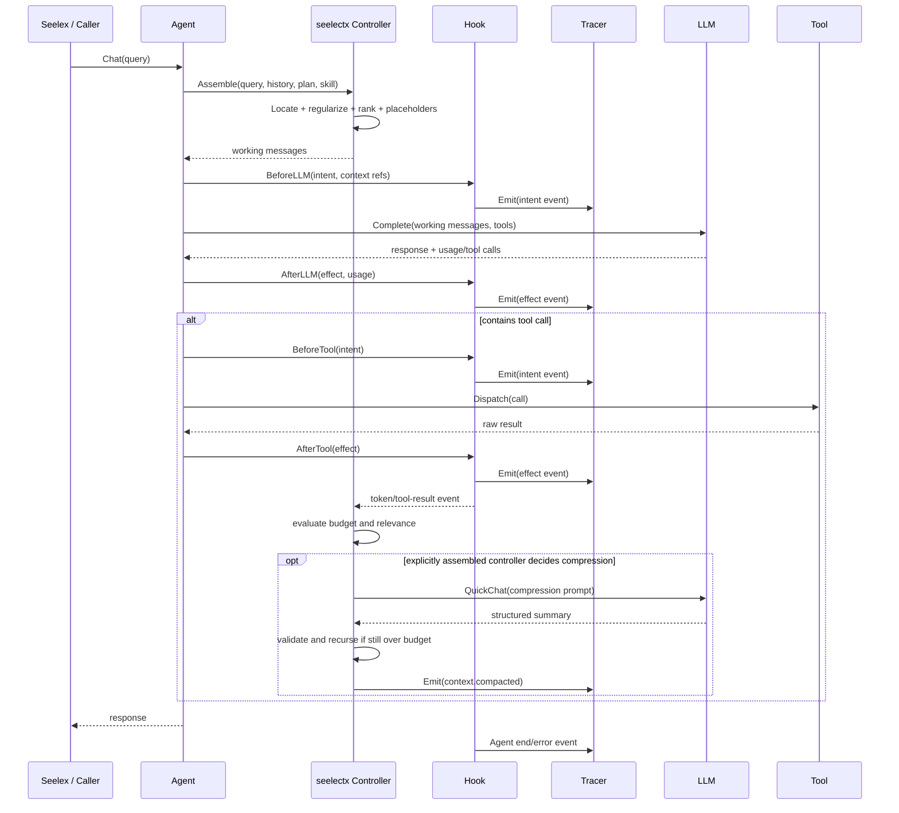

# 根能力破坏性重构实施方案

## 设计目标

本次重构将 Seele 收敛为五个平行的根能力：`agent`、`workplan`、`accountpool`、`seelectx`、`tools`。它们通过最小接口协作，不通过产品 DSL、任务语义或隐藏的全局状态耦合。

其中 `agent` 是 LLM client 与装配根（composition root），不是工具实现的父模块。`tools` 与 `agent` 平行；Agent 只注入工具运行接口，不持有或默认创建 Holder、MCP、microHub、Skills、文件/Git/工作区工具实现。

核心约束如下：

1. `agent` 只负责 LLM client、装配账号池/工具/上下文能力，并提供 `Chat`、`ChatStream` 等执行入口；工具 provider 的实现归属 `tools`。
2. `workplan` 是唯一的执行图与计划内核，调度器只认识 `Node`、`Edge` 和运行上下文。
3. `accountpool` 只负责账号并发租约和 P2C 负载选择，不承担产品计费、预算或远端中转职责。
4. `seelectx` 提供显式的历史、请求、压缩、临时对话和工具结果装配能力；任何压缩都必须由调用方触发。
5. `tools` 提供 Function Calling 合约和 FC、MCP、microHub、Skills、普通工具 Provider 的适配边界，不反向依赖 `agent`。
6. Task 属于 Seelex 产品层。Seele 不新增 TaskList 内核，Plan 节点需要 Task 时由外部节点适配器组合。

## 设计模式选择

| 模式 | Go 实现 | 应用位置 | 理由 |
| --- | --- | --- | --- |
| Strategy | `Selector`、`RequestAssembler`、`ResultProcessor` 接口 | `accountpool`、`seelectx` | 允许产品层替换选择、组装和筛选策略 |
| Adapter | Provider、Node codec、client resolver | `tools`、`workplan`、`agent` | 隔离外部协议与 Seele 内核 |
| Factory Method | `NodeFactory`、Provider 构造函数 | `workplan`、`tools` | 任意节点和协议实现由调用方显式注入 |
| Builder | functional options | `agent`、`accountpool`、`workplan` | 支持最小默认能力与可选装配 |
| Lease | `AccountLease` | `accountpool` | 将信号量获取、client 使用和释放绑定为可验证生命周期 |

## 方案对比

| 维度 | 方案 A：根包收敛并一次迁移 | 方案 B：保留旧包并增加 facade |
| --- | --- | --- |
| 耦合度 | 低；依赖方向可由 import 测试固定 | 高；新旧状态源长期并存 |
| 内聚性 | 高；每个根包只有一种职责 | 中；旧 `agent/core/*` 和 `workplan/runtime/graph` 继续泄漏语义 |
| 可测试性 | 高；接口、算法和生命周期可独立测试 | 中；多数测试仍穿透 facade |
| 实现成本 | 高；需要迁移仓库内全部调用方 | 中；短期改动较少 |
| 改动面 | 大且明确 | 初期小、长期持续扩大 |
| 可回滚性 | 按切片回滚，不能逐 API 混用 | 表面容易回滚，但难判断实际状态源 |
| 二次开发 | 可替换 client、Node、Provider 和上下文策略 | 扩展者必须理解兼容层和隐式特判 |

## 推荐：方案 A

方案 A 能消除当前 `Graph -> Plan` 转发、Scheduler 识别 AgentFactory、Agent 自动注册产品工具、ReAct 持有长期 history 等根因。最大风险是一次迁移影响面较大，因此实施时采用垂直切片：每个根能力先确定接口，再迁移调用方和测试，最后删除旧入口，不在切片之间保留双状态写入。

## 目标目录与依赖

```text
accountpool/       账号、负载选择、租约、信号量
agent/             client + accountpool + tools + seelectx 装配
seelectx/          history/request/compression/quickchat/result processing
tools/             FC 合约与各类 provider adapter
workplan/          Plan/Node/Edge/codec/runtime/nodes
```

允许的核心依赖方向：

```text
agent -> accountpool
agent -> seelectx
agent -> tools (contracts only)
workplan/runtime -> workplan contracts
tools providers -> tools contracts
```

禁止的依赖方向：

```text
workplan -> agent
workplan -> seelectx
workplan -> task
seelectx -> agent
tools -> agent
accountpool -> agent
```

最终迁移验收要求：`tools` 的实现包不得导入 `agent`；`agent` 的显式构造路径不得导入 `agent/core/tool/*`、`agent/gateway/tool` 或具体 MCP/microHub provider。旧路径必须迁移到根 `tools` 后删除，而不是以类型别名长期保留。

## 核心接口定义

### WorkPlan

```go
type Node interface {
    ID() string
    Run(context.Context, RunInput) (RunOutput, error)
}

type NodeFactory interface {
    BuildNode(context.Context, NodeSpec) (Node, error)
}

type PlanView interface {
    Entry() string
    Node(string) (Node, bool)
    Successors(string) []string
    Predecessors(string) []string
}
```

Plan 自身负责可编辑状态、校验和封存。JSON codec 只处理通用节点规格和邻接关系；任意节点实例由 `NodeFactory` materialize。邻接表和邻接矩阵共享同一语义校验器，错误必须包含字段路径、节点/边标识和原因。

### AccountPool

```go
type ClientFactory[C any] interface {
    NewClient(context.Context, Account) (C, error)
}

type Selector interface {
    Select([]Candidate) (string, error)
}

type Lease[C any] interface {
    Account() Account
    Client() C
    Release()
}
```

默认实现使用 `sync.Map` 保存账号状态，每个账号以有界 `chan struct{}` 表示并发容量。P2C 随机抽取两个可用账号，比较 `inflight/capacity`，在负载相同的情况下使用稳定随机或轮换决胜。

### Tools

```go
type Function interface {
    Definition() Definition
    Call(context.Context, json.RawMessage) (Result, error)
}

type Provider interface {
    Functions(context.Context) ([]Function, error)
}

type Dispatcher interface {
    Dispatch(context.Context, Call) (Result, error)
}
```

FC、MCP、microHub、Skills 和普通工具分别实现 Provider 或 Adapter；权限、超时、中间件和可见性包装 Dispatcher，不进入具体工具实现。

### Seele Context

```go
type History interface {
    Snapshot(context.Context) ([]Message, error)
    Append(context.Context, ...Message) error
}

type RequestAssembler interface {
    Assemble(context.Context, AssembleRequest) (CompletionRequest, error)
}

type Compressor interface {
    Compress(context.Context, CompressionRequest) (CompressionResult, error)
}

type ToolResultProcessor interface {
    Process(context.Context, ToolResult) (ContextBlock, error)
}
```

`History` 是可注入依赖，不由 ReAct 自动持久化。ReAct 只维护一次运行中的 working messages。压缩器和 QuickChat 是显式能力，不得在 loop 中根据 token 阈值自行触发。

Context 还必须拆成可以单独替换的原子策略：

- `Locator`：按 turn、字符预算和语义边界定位、切片，并识别连续的 tool-use/tool-result 结构。
- `Regularizer`：合并或扁平化工具记录，保留调用与结果的结构关系。
- `RelevanceRanker`：根据当前 query 对历史块评分、排序和丢弃。
- `PlaceholderAssembler`：在 system、history、plan、skill 或工具结果之间预留命名插入点。
- `CompressionPrompt`：按压缩用途动态生成提示词，不把产品压缩提示固化进 Seele。
- `CompressionController`：短对话直接返回原文；超过预算时递归压缩，直到满足预算或返回可诊断的不可收敛错误。

`CompressionController` 可以订阅 Hook 的结构化 token/tool-result 事件并自主决策，但它只有在调用方显式装配后才生效。Agent 和 ReActLoop 不提供隐藏的默认控制器。

### Hook

```go
type Event struct {
    Time          time.Time
    Type          EventType
    TraceID       string
    SpanID        string
    ParentSpanID  string
    CorrelationID string
    Phase         Phase
    Attributes    map[string]any
    Error         *EventError
}

type Hook interface {
    Before(context.Context, Event) (context.Context, error)
    After(context.Context, Event) error
}

type EventSink interface {
    Emit(context.Context, Event) error
}
```

Hook 覆盖 Agent、LLM、Tool、Handoff 和 Error 生命周期。Before 记录意图，After 使用相同 `CorrelationID` 记录实际效果。中间件只负责捕获和标准化，不直接持久化、展示或改变业务结果；需要阻断时由显式 Policy Hook 返回错误。

事件命名和属性遵循 OpenTelemetry 语义约定：通用 trace/span 字段使用 OTel 对应概念，GenAI 相关属性优先采用稳定的 `gen_ai.*` 语义键；Seele 扩展字段必须位于独立命名空间。

### Tracer

```go
type Tracer interface {
    Start(context.Context, SpanStart) (context.Context, Span, error)
    Emit(context.Context, Event) error
}

type TraceStore interface {
    Append(context.Context, Event) error
    Query(context.Context, TraceFilter) ([]Event, error)
}

type MetricSink interface {
    Record(context.Context, MetricPoint) error
}

type AuditSink interface {
    AppendAudit(context.Context, AuditRecord) error
}
```

Tracer 将并行子 Agent 挂在同一个 Trace 下的不同 child span，按 `CorrelationID` 聚合 intent/effect，并把同一事件流投影为三种用途：结构化 trace、时序 metric 和不可变审计记录。可视化层只依赖查询和订阅接口，以瀑布图、节点状态图或条件过滤展示，不反向控制 Agent。

### Agent

```go
type Completer interface {
    Complete(context.Context, CompletionRequest) (CompletionResponse, error)
}

type StreamCompleter interface {
    CompleteStream(context.Context, CompletionRequest) (Stream, error)
}

type ClientResolver interface {
    Acquire(context.Context, ClientRequest) (ClientLease, error)
}
```

直接注入的 `Completer` 是最低标准。`ClientResolver`、工具、上下文装配器和 durable history 都是可选能力；硬编码 key 或自定义 entry 的 client 只要实现最小接口即可使用。

## 多轮长对话时序



职责分配：Context 只决定“给下一次模型调用什么内容”；Hook 只捕获执行前意图与执行后效果；Tracer 只负责关联、存储、聚合、查询和展示投影。三者通过结构化事件协作，不共享可变内部状态。

## 实施步骤

| # | 步骤 | 主要文件 | 设计模式 |
| --- | --- | --- | --- |
| 1 | 将 Plan、Node、Edge 收敛为唯一 workplan 核心，删除 Graph facade 和 NodeKind 特判 | `workplan/core/*`、`workplan/runtime/*` | Strategy、Adapter |
| 2 | 增加邻接表/矩阵 codec、NodeFactory 和结构化错误 | `workplan/codec/*` | Factory Method |
| 3 | 增加通用 FunctionNode、AutoNode 抽象实现，调度器只调用 Node | `workplan/nodes/*` | Adapter |
| 4 | 新建 P2C accountpool 并迁移 agent 的账号选择 | `accountpool/*`、`agent/core/api/*` | Strategy、Lease |
| 5 | 新建 tools 根合约并迁移 FC/MCP/microHub/Skills provider | `tools/*`、`agent/core/tool/*` | Adapter、Decorator |
| 6 | 拆分 seelectx 的 history、request、compression、result processing | `seelectx/*`、`engine/*` | Strategy |
| 7 | 将 agent 改为显式构造装配，移除默认产品工具和隐藏账号池构建 | `agent/*` | Builder、DI |
| 8 | 增加 Hook/Tracer 事件、OTel 语义映射、关联、存储与查询接口 | Hook/Tracer 包、`seelectx/tracer/*` | Decorator、Observer |
| 9 | 更新根模块文档、架构文档、示例与仓库内调用方 | 各模块 `README.md`、`docs/arch/*` | — |

## 测试策略

### WorkPlan

- Node interface 的 function、auto adapter 和自定义节点执行。
- DAG 校验：缺失 entry、重复节点、悬空边、自环、一般环、不可达节点。
- 邻接表和邻接矩阵双向 round-trip。
- NodeFactory materialize 失败时返回精确字段路径和节点 ID。
- 并发、取消、Join、失败传播和分支上下文隔离。
- 混合 function/agent adapter 计划；子代理 Task 由测试侧外部 adapter 提供。

### AccountPool

- 单账号、双账号、多账号 P2C 选择。
- 并发容量、超时、取消、幂等释放和禁用账号。
- 持续负载下优先选择低占用率账号。
- client 创建失败不泄漏令牌。
- `-race` 可用时验证租约和动态账号更新。

### Tools

- FC 参数校验和结构化错误。
- Provider 聚合的重名、可见性和生命周期。
- MCP、microHub、Skills adapter 的协议映射。
- permission、timeout、middleware 顺序和 raw result 保留。

### Seelectx 与 Agent

- 无 durable history 的临时 Chat。
- 注入 history 时显式读取与追加。
- RequestAssembler 对 system/plan/skill/task block 的可选组合。
- ToolResultProcessor 的 raw、filtered、reference 三种策略。
- 压缩只在调用 `Compress` 时发生，且不污染主 working history。
- 直接 client 和 accountpool resolver 两条路径。
- turn/字符/语义边界切片和 tool-use/tool-result 配对定位。
- 结构规整、Placeholder 插入、query 相关性排序和低相关度丢弃。
- 极短对话不会调用 QuickChat；递归压缩能收敛到预算或返回不可收敛错误。

### Hook 与 Tracer

- Agent、LLM、Tool、Handoff、Error 生命周期事件完整性。
- Before/After 使用相同 correlation ID 聚合 intent/effect。
- 并行子 Agent 保持共同 TraceID、独立 SpanID 和正确 parent。
- OTel/GenAI 语义属性映射与 Seele 扩展命名空间。
- trace、metric、audit sink 相互隔离；单个可选 sink 失败策略可配置。
- 时间、trace/span/correlation ID、事件类型和状态查询。
- 瀑布图和节点状态图的 ViewModel 生成，不在核心包引入前端依赖。

### 全仓验证

```text
go test ./...
go vet ./...
go build ./...
```

真实 API 冒烟测试必须通过环境变量或测试注入读取凭证，并在没有凭证时明确 skip。验证内容包括真实 Chat、ChatStream、混合节点 Plan 和子代理节点执行。Windows 若因缺少 C 编译器不能执行 race，报告环境限制，不以普通单元测试替代 race 结论。

## 回滚方案

每个根能力作为一个独立切片保留清晰 diff。出现问题时只回滚对应切片，不恢复 Graph facade、NodeKind 调度特判或 ReAct 自动压缩。若下游尚未迁移完成，使用测试侧或调用方 adapter 临时桥接，不在核心包内建立双写或双状态源。
